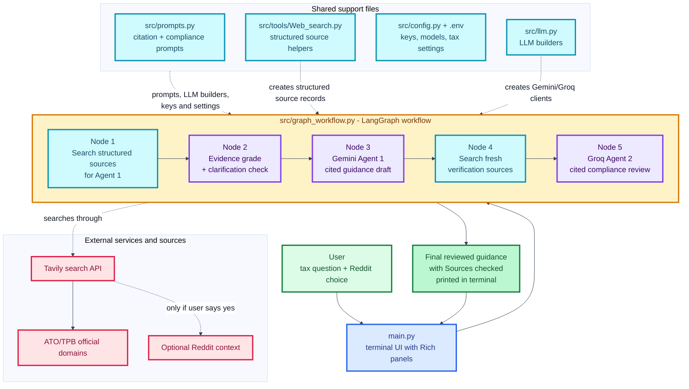
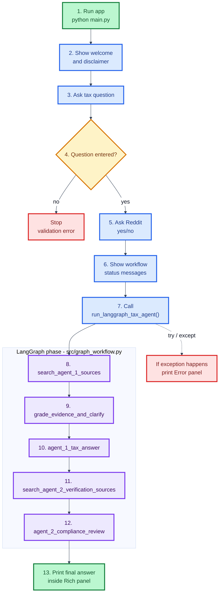
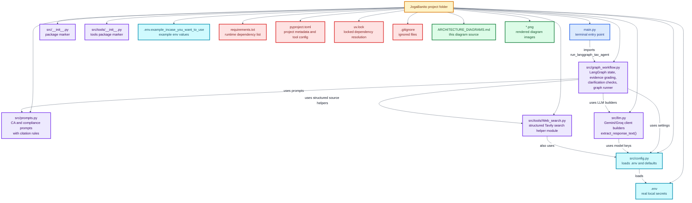
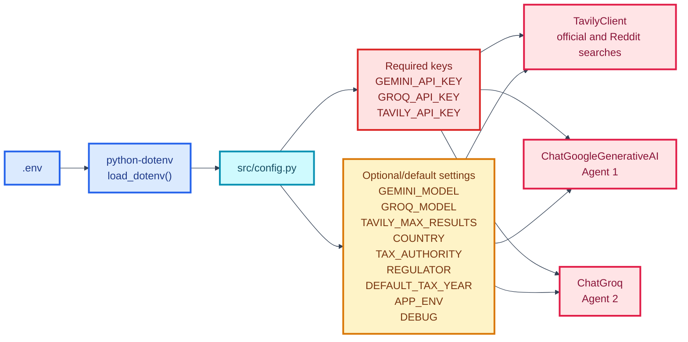
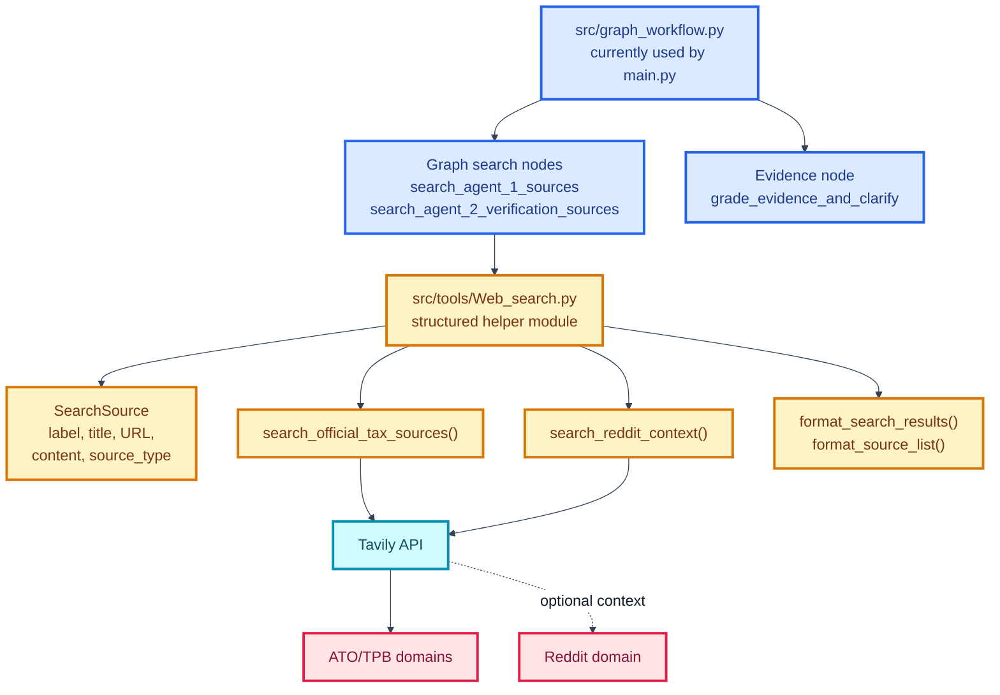

# JogaBanito System and Architecture Diagrams

This document explains the current code structure in simple language.

The project is now a LangGraph-based terminal app. The user enters an Australian tax question and chooses whether Reddit/public discussion should be included. The app searches official ATO/TPB sources with Tavily, optionally searches Reddit, keeps source results as structured citation records, grades the strength of official evidence, identifies missing facts that may need clarification, asks Gemini to create the first tax guidance answer, searches official sources again to verify that answer, asks Groq to perform the compliance review with mandatory citations, and prints the final safer answer.

The Mermaid diagrams in this file are the source of truth for the current architecture.

## 1. Big Picture System Diagram

## 2. Step-by-Step Runtime Flow

## 3. File and Module Logic

## 4. LangGraph Workflow and State

```mermaid
%%{init: {"theme": "base", "themeVariables": {"background": "#ffffff", "primaryTextColor": "#111827", "textColor": "#111827", "lineColor": "#334155", "edgeLabelBackground": "#ffffff", "fontFamily": "Arial", "fontSize": "18px"}}}%%
flowchart LR
    start(["START"])
    state0["Initial TaxAgentState<br/>user_question<br/>include_reddit<br/>empty structured source fields"]

    node1["search_agent_1_sources<br/>official ATO/TPB search<br/>optional Reddit search"]
    state1["State update<br/>agent_1_official_sources<br/>agent_1_reddit_sources<br/>structured SearchSource records"]

    node2["grade_evidence_and_clarify<br/>score official evidence<br/>detect missing material facts"]
    state2["State update<br/>evidence_grade<br/>evidence_summary<br/>clarification_questions"]

    node3["agent_1_tax_answer<br/>Gemini uses CA_AGENT_PROMPT<br/>with citations + missing facts"]
    state3["State update<br/>agent_1_answer"]

    node4["search_agent_2_verification_sources<br/>fresh official verification search<br/>optional Reddit context"]
    state4["State update<br/>agent_2_official_sources<br/>official_source_citations"]

    node5["agent_2_compliance_review<br/>Groq uses COMPLIANCE_AGENT_PROMPT<br/>mandatory Sources checked section"]
    state5["State update<br/>final_answer"]
    endNode(["END"])

    start --> state0 --> node1 --> state1 --> node2 --> state2 --> node3 --> state3 --> node4 --> state4 --> node5 --> state5 --> endNode

    classDef startEnd fill:#bbf7d0,stroke:#15803d,color:#14532d,stroke-width:3px
    classDef state fill:#dbeafe,stroke:#2563eb,color:#1e3a8a,stroke-width:3px
    classDef search fill:#cffafe,stroke:#0891b2,color:#164e63,stroke-width:3px
    classDef agent fill:#ede9fe,stroke:#7c3aed,color:#3b0764,stroke-width:3px

    class start,endNode startEnd
    class state0,state1,state2,state3,state4,state5 state
    class node1,node4 search
    class node2,node3,node5 agent
```

## 5. Configuration and External Services

## 6. Current Data Flow in One Line

```mermaid
%%{init: {"theme": "base", "themeVariables": {"background": "#ffffff", "primaryTextColor": "#111827", "textColor": "#111827", "lineColor": "#334155", "edgeLabelBackground": "#ffffff", "fontFamily": "Arial", "fontSize": "18px"}}}%%
flowchart LR
    input["Question + Reddit choice"]
    sources1["Structured ATO/TPB sources<br/>optional Reddit context"]
    grade["Evidence grade<br/>+ clarification questions"]
    draft["Gemini Agent 1<br/>cited draft answer"]
    sources2["Fresh structured verification<br/>source citation list"]
    final["Groq Agent 2<br/>final cited answer"]
    terminal["Terminal output"]

    input --> sources1 --> grade --> draft --> sources2 --> final --> terminal

    classDef inputNode fill:#dbeafe,stroke:#2563eb,color:#1e3a8a,stroke-width:3px
    classDef sourceNode fill:#cffafe,stroke:#0891b2,color:#164e63,stroke-width:3px
    classDef agent fill:#ede9fe,stroke:#7c3aed,color:#3b0764,stroke-width:3px
    classDef output fill:#bbf7d0,stroke:#15803d,color:#14532d,stroke-width:3px

    class input inputNode
    class sources1,sources2 sourceNode
    class grade,draft,final agent
    class terminal output
```

## 7. Search Logic and Helper Module

## 8. What Each Important File Does

| File | Main responsibility | Easy explanation |
| --- | --- | --- |
| `main.py` | Terminal entry point | Shows the welcome/disclaimer, asks for a tax question, asks whether to include Reddit, runs the LangGraph workflow, and prints the final answer or error. |
| `src/graph_workflow.py` | Main application workflow | Defines the shared graph state, evidence grading, clarification checks, five LangGraph nodes, graph edges, and `run_langgraph_tax_agent()`. |
| `src/prompts.py` | Prompt library | Stores the CA guidance prompt and compliance review prompt, including official-source, Reddit, citation, evidence, and clarification rules. |
| `src/llm.py` | LLM setup | Builds the Gemini client for Agent 1, the Groq client for Agent 2, and extracts response text. |
| `src/config.py` | Settings loader | Loads `.env`, validates required API keys, and stores model/search/tax settings. |
| `src/tools/Web_search.py` | Search helper module | Contains reusable Tavily helper functions that return structured `SearchSource` records and format them for prompts and source lists. |
| `requirements.txt` | Runtime dependencies | Lists the smaller current runtime package set. |
| `uv.lock` | Dependency lockfile | Records resolved dependency versions from uv. |

## 9. Plain-English Summary

The current app starts in `main.py`. It asks the user for a question and asks whether Reddit context should be included. Then it calls `run_langgraph_tax_agent()` from `src/graph_workflow.py`.

The LangGraph workflow runs five nodes in order. First it searches official ATO/TPB sources, and optionally Reddit, keeping the results as structured citation records. Next it grades the evidence strength and identifies missing facts that could change the tax answer. Gemini then creates Agent 1's first answer using those citation labels and clarification notes. The workflow searches fresh official sources to verify Agent 1's answer, again optionally adding Reddit context. Finally, Groq creates the compliance-reviewed final answer with a mandatory "Sources checked" section, which `main.py` prints in the terminal.
